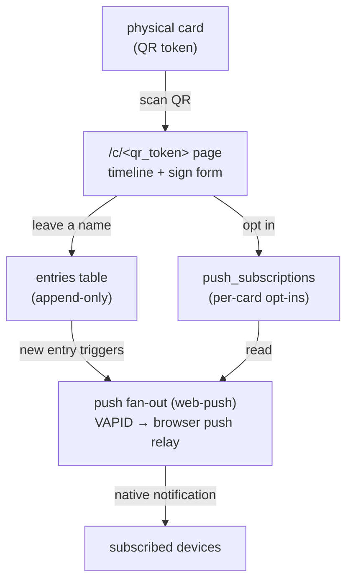

# Gratitude Trail


A small experiment in physical gratitude. A printed card carries a QR code.
When someone scans it, they land on a page that shows every person who has held
that card before them — and they can leave their own name, and a note.

> Each token page picks a random warm accent color on every load — amber,
terracotta, sage, teal, mauve — so no two visits feel quite the same.


## Print these on the card's reverse side


> The card travels. The list grows. Each scan is a quiet act of presence.

## Optional web push notifications

After signing, visitors can opt in to **push notifications** — the next time
anyone signs that same card, their device gets a native notification. No
account required, no app to install (except adding to home screen on iOS); the
browser's Web Push API handles delivery.

## 



---

## Data model

Two tables. The whole idea is an **append-only log keyed by card** — the
ordered `entries` for a card *are* the timeline.

### `cards` — one row per physical card

| column       | type          | notes                                                    |
|--------------|---------------|----------------------------------------------------------|
| `id`         | `uuid` PK     | internal id; what foreign keys point at                  |
| `qr_token`   | `text` unique | random unguessable slug encoded in the QR URL            |
| `title`      | `text` null   | optional label, e.g. *"Morning Fog on Water"*            |
| `created_at` | `timestamptz` | mint time                                                |
| `retired_at` | `timestamptz` | soft-stop: scans rejected, history preserved             |

### `push_subscriptions` — Web Push opt-ins

| column       | type          | notes                                                    |
|--------------|---------------|----------------------------------------------------------|
| `id`         | `serial` PK   |                                                          |
| `card_id`    | `uuid` FK     | → `cards.id`, `on delete cascade`                        |
| `endpoint`   | `text` unique | browser-issued push URL                                  |
| `p256dh`     | `text`        | browser public key for payload encryption                |
| `auth`       | `text`        | auth secret for payload encryption                       |
| `created_at` | `timestamptz` |                                                          |
| `updated_at` | `timestamptz` | stamped on upsert when a subscription is refreshed       |

One row per browser instance that opted in on a specific card. Dead
subscriptions (410 / 404 from the push relay) are pruned automatically on the
next fan-out.

### `entries` — the timeline of holders

| column       | type          | notes                                                    |
|--------------|---------------|----------------------------------------------------------|
| `id`         | `uuid` PK     |                                                          |
| `card_id`    | `uuid` FK     | → `cards.id`, `on delete cascade`                        |
| `username`   | `text`        | free-text display name, 1–40 chars (CHECK)               |
| `message`    | `text` null   | optional note, ≤ 280 chars (CHECK)                       |
| `created_at` | `timestamptz` | ordering key for the timeline                            |

Timeline query: `select … from entries where card_id = $1 order by created_at asc`,
served by the `entries_card_created_idx` index.

---

## Design decisions

**QR encodes a random token, not the primary key.**
The URL is `/c/<qr_token>` where the token is a 12-char nanoid (~71 bits of
entropy). A sequential ID or UUID in the URL would let anyone enumerate every
card. The token is a *capability* — holding the printed card is what grants
access. The `uuid` PK stays internal.

**Append-only entries, never updated or deleted.**
A gratitude timeline is a record of moments; mutating it would let someone
rewrite history. Treating `entries` as an immutable log keeps the model simple
and the timeline trustworthy. "Editing" is just appending.

**Soft retire instead of delete.**
A printed QR can't be unprinted. `retired_at` lets you stop accepting new
scans on a card while keeping its full history intact. `getActiveCardByToken`
returns `null` for both unknown *and* retired tokens — the API never leaks
whether a card exists.

**Username as free text in v1.**
People self-identify by a display name. The same name may legitimately appear
across cards, and there is no auth. A `users` table with uniqueness would force
awkward questions ("is *alex* on card A the same person as *alex* on card B?").
Storing the name on the entry sidesteps that entirely. See *Not here yet* for
the upgrade path.

**Push notifications via Web Push + VAPID, no third-party service.**
The server sends notifications directly to the browser's push relay (Google's
for Chrome, Mozilla's for Firefox) using the standard Web Push protocol.
VAPID keys identify the server — generate once and store as env vars. No
Firebase, no external account. Dead subscriptions are pruned on the next
fan-out. On iOS, the app must be installed to the home screen (PWA) first;
the `manifest.json` enables this for iOS 16.4+.

**Postgres over Firestore.**
The core operation is an *ordered, relational* read. Postgres wins here: CHECK
constraints enforce data quality at the storage layer, the timeline is a plain
SQL query, and relational growth (a real `users` table, analytics) is natural.
`@vercel/postgres` is also a first-class Vercel primitive. Firestore would work,
but ordering and integrity are more awkward and schema management is harder to
reason about long-term.

---

## What's not here yet (deliberately)

- **Rate limiting.** Anyone with the URL can POST. Before going public add a
  per-IP limit (Vercel KV / Upstash) and consider guarding against the same
  name appending twice in a row.
- **Normalising usernames.** To attribute timelines to real accounts later: add
  a `users` table, a nullable `entries.user_id` FK, backfill, make it required.
  The free-text `username` can stay as the displayed-at-signing value.
- **Moderation.** A `hidden_at` soft-flag on entries would be the one exception
  to append-only — a hard delete is never the right move on a timeline.

---

## Stack

Next.js 14 (App Router) · `@vercel/postgres` · `web-push` · Playfair Display +
Lora via `next/font/google`. Deploys to Vercel; runs locally against any
Postgres.

```
db/
  migrations/0001_init.sql               cards + entries tables
  migrations/0003_push_subscriptions.sql push opt-in table
  migrations/0004_push_subscriptions_updated_at.sql

src/
  lib/db.ts                     postgres client + row types
  lib/cards.ts                  data access: resolve token, timeline, append, mint
  lib/push.ts                   VAPID setup, save/remove subscription, fan-out sender
  app/layout.tsx                fonts, manifest, SW registration
  app/sw-register.tsx           client component — registers public/sw.js
  app/globals.css               animations, hover states, CSS variable theming
  app/page.tsx                  home — rotating quote + signed-cards history
  app/signed-cards.tsx          client component — localStorage → card list
  app/c/[token]/page.tsx        scan landing — accent + live timeline
  app/c/[token]/entries-context.tsx  shared polling context (count + list)
  app/c/[token]/sign-form.tsx   sign form + subscribe button
  app/c/[token]/live-entries.tsx     animated live entry list
  app/c/[token]/live-count.tsx       live soul count in header
  app/api/cards/[token]/entries/route.ts   GET timeline / POST entry + push fan-out
  app/api/cards/[token]/subscribe/route.ts POST subscribe / DELETE unsubscribe

public/
  sw.js                         service worker — push handler + notification click
  manifest.json                 PWA manifest (required for iOS push support)
  icon.png                      app icon (notifications + favicon + home screen)

scripts/new-card.ts             mint a card and print its QR URL
```

---

## Local setup

```bash
cp .env.example .env        # point POSTGRES_URL at your local Postgres
pnpm install
createdb gratitude          # or any Postgres instance you control
pnpm db:migrate
pnpm db:seed                # optional — loads a demo card + sample timeline
pnpm dev                    # → http://localhost:3000/c/demo-card-001
```

**Generate VAPID keys** (one-time — commit the public key, keep the private key secret):

```bash
npx web-push generate-vapid-keys
```

Add to `.env`:

```env
NEXT_PUBLIC_VAPID_PUBLIC_KEY=<public key>
VAPID_PRIVATE_KEY=<private key>
VAPID_SUBJECT=mailto:you@example.com
```

Mint a new card:

```bash
pnpm card:new "Morning Fog on Water"
# prints: /c/<token>  — paste into any QR generator
```

---

## Deploy to Vercel

1. Push this repo and import it in Vercel.
2. Add a Postgres store (Storage → Postgres / Neon) — `POSTGRES_URL` is
   injected automatically.
3. Run `0001_init.sql` once against it (Vercel's SQL console or `psql`).
4. Set `NEXT_PUBLIC_BASE_URL` to your production domain.
5. Mint cards, print QR codes, set them free.
